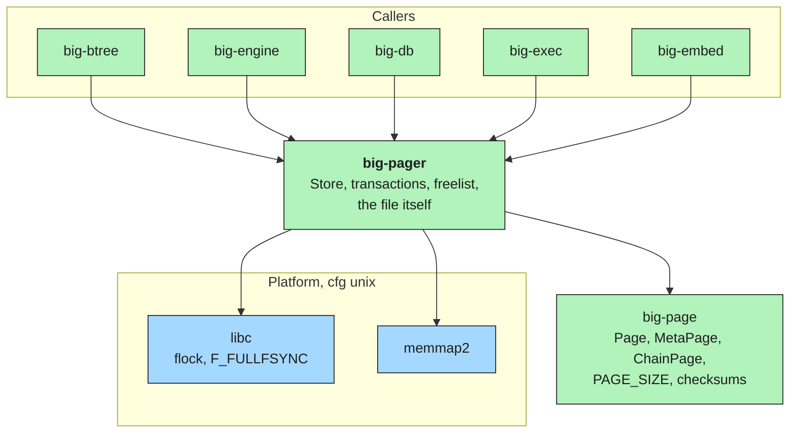
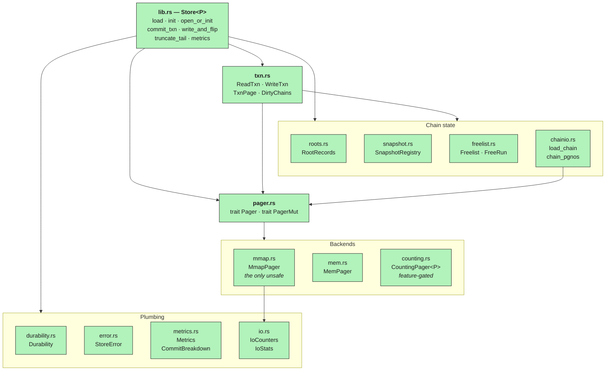
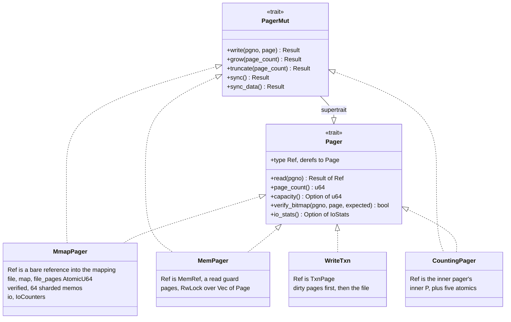
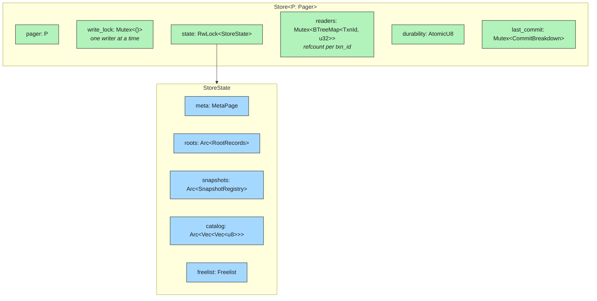
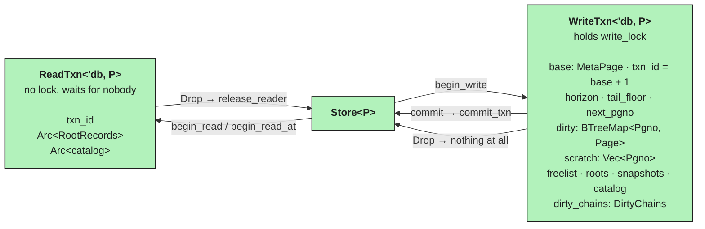
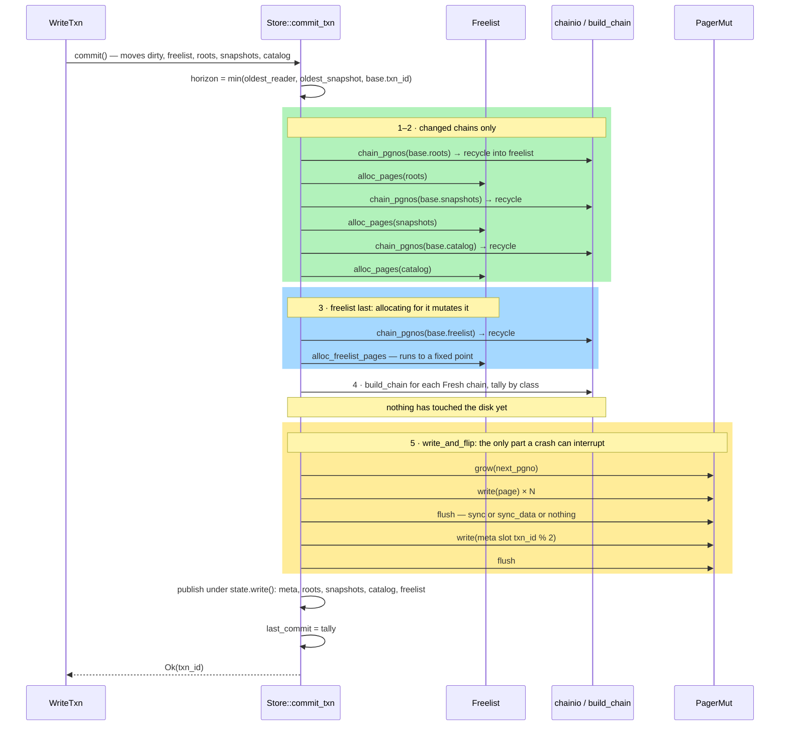
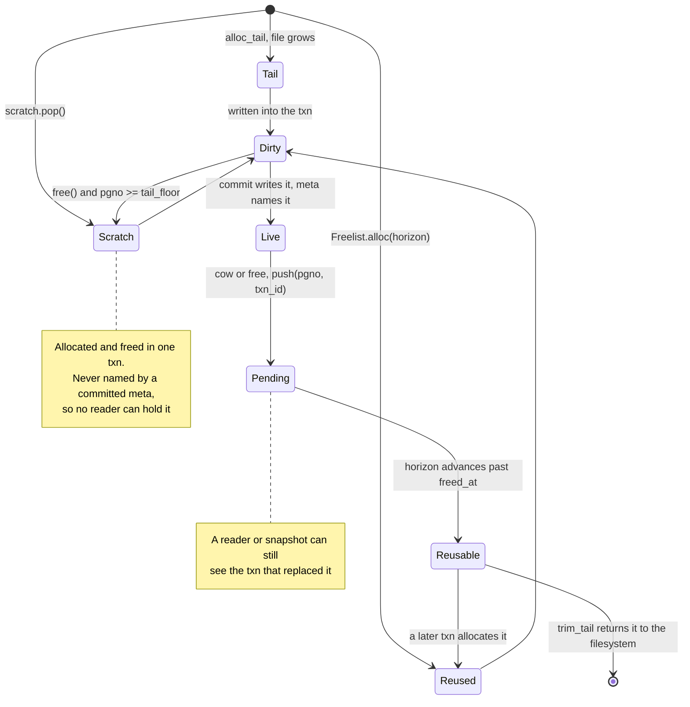
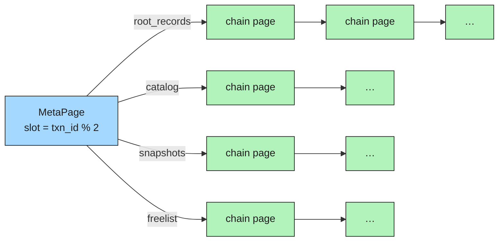
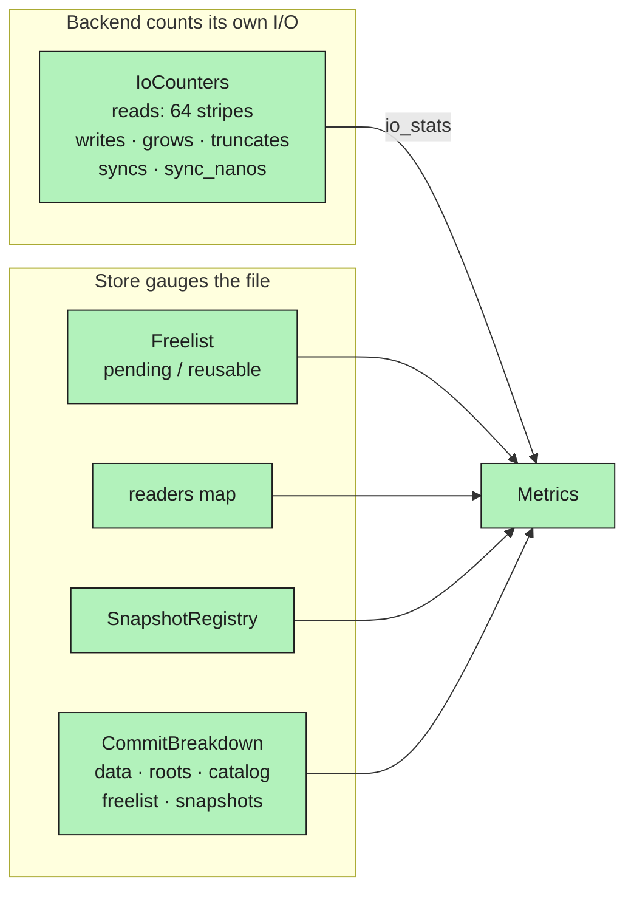
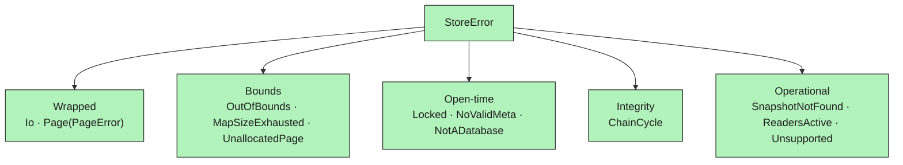

# `big-pager` — internal component map

How this crate is put together, and which piece is allowed to know about which. The *why* of
each design decision lives in [`readme.md`](readme.md); this file is the wiring diagram you want
open next to it when you are changing something.

Everything below is drawn from `src/`. Nothing here is aspirational.

---

## 1. Where the crate sits

`big-pager` owns the part of the format that describes the file itself — meta page, root
records, snapshot registry, freelist, page allocation, and the commit sequence. It depends on
exactly one internal crate.



**The direction is one-way and load-bearing.** Nothing above this crate sees a file, a mapping,
or an `unsafe` block — `lib.rs` carries `#![deny(unsafe_code)]`, and `mmap.rs` is the single
module that lifts it.

---

## 2. Module map



| Module | Owns | Talks to |
|---|---|---|
| `lib.rs` | `Store<P>`, the commit sequence, page allocation, recovery | everything |
| `pager.rs` | `Pager` / `PagerMut` — the only storage vocabulary | nothing (traits only) |
| `mmap.rs` | `MmapPager`: mmap read path, `pwrite` write path, `flock`, verified-page memo | `io.rs`, `libc`, `memmap2` |
| `mem.rs` | `MemPager`: in-RAM backend for unit tests | — |
| `counting.rs` | `CountingPager<P>`: call-tallying decorator, test-only | any `P` |
| `txn.rs` | `ReadTxn`, `WriteTxn`, `TxnPage`, `DirtyChains` | `Store`, the three state types |
| `roots.rs` | `RootRecords`: `FragmentKey → Pgno`, a `BTreeMap` | — |
| `snapshot.rs` | `SnapshotRegistry`, `Snapshot` | — |
| `freelist.rs` | `Freelist`, `FreeRun`: run-length free space | — |
| `chainio.rs` | Reading a chain off disk, cycle-guarded | `Pager` |
| `durability.rs` | `Durability`: `Full` / `Barrier` / `None` | — |
| `metrics.rs` | `Metrics`, `CommitBreakdown` | `io.rs`, `durability.rs` |
| `io.rs` | `IoCounters` (striped), `IoStats` | — |
| `error.rs` | `StoreError`, `Result<T>` | `big_page::PageError` |

---

## 3. The storage boundary

Two traits, split so a read-only replica can implement half of it.



Three properties of this shape are relied on elsewhere:

- **`Ref<'a>` is a GAT**, so a backend may return a guard rather than a bare reference. `MemPager`
  returns a `RwLockReadGuard` wrapper; a future buffer pool would return a pinned-page guard.
- **The write side takes `&self`.** Writer exclusivity is an invariant of `Store`, not of the
  backend — with `&mut self` a reader and a writer could not coexist.
- **`WriteTxn` is itself a `Pager`**, which is what lets `big-btree` descend through pages the
  transaction has not committed yet using the same code it uses against a committed tree.

---

## 4. `Store<P>` — what it owns and what guards what



### 4.1 Lock hierarchy

Taken outermost-first, everywhere in the crate. There is no path that takes them in any other
order, which is what keeps the thing deadlock-free.

```
write_lock  ─┬─→  state (read or write)  ─┬─→  readers
             │                            └─→  last_commit
             └─→  readers
```

| Lock | Held by | For how long |
|---|---|---|
| `write_lock` | `WriteTxn` (its `MutexGuard` is a field), `set_durability`, `truncate_tail` | the whole transaction |
| `state` | every reader of `meta` / `roots` / `catalog`; `commit_txn`'s final publish | one statement |
| `readers` | `register_reader`, `release_reader`, `oldest_reader` | one statement |
| `last_commit` | written once per commit, read by `metrics()` | one statement |

`durability` is an `AtomicU8` rather than a field of `StoreState` so that reporting metrics never
has to wait on a lock. Poisoning is deliberately ignored on `write_lock` (`Err(p) => p.into_inner()`):
a panicked writer left nothing on disk, so there is no corrupt state to protect.

### 4.2 Why `Arc` on three of the five fields

`roots`, `snapshots` and `catalog` are handed out to readers by `Arc::clone` under the state
lock. A `ReadTxn` therefore keeps the exact snapshot it opened with, even as commits replace
what `StoreState` points at. `catalog` is captured *with* the roots for a specific reason: read
in two steps, a reader can land between a commit's two publishes and pair fresh roots with a
stale schema — which shows up as a just-written fragment being invisible rather than as an error.

---

## 5. Transactions



| | `ReadTxn` | `WriteTxn` |
|---|---|---|
| Lock | none | `write_lock` for its whole life |
| Registers | yes, `readers[txn_id] += 1` | no |
| Sees | its `Arc` snapshot of roots + catalog | its own dirty pages, then the file |
| Rollback | n/a | doing nothing — no page reached the disk |
| Concurrency | many | exactly one |

**`DirtyChains` is the cost control.** A commit rewrites a chain *whole*, so a chain nobody
touched would cost its entire length in pages for nothing. `dirty_chains` records which of
`roots` / `catalog` / `snapshots` actually changed; the freelist is absent from the struct
because every commit changes it by definition — it records the pages that commit is recycling.

---

## 6. The commit sequence



**Atomicity lives entirely in the meta write.** Until the meta page lands, every byte written
above it is unreachable garbage and a crash costs nothing. After it lands, all of it is live.
There is no state in between — which is the whole reason there is no WAL and nothing to replay.

The two flushes move together at every `Durability` level. A level that skipped the first but
kept the second would let the meta page reach the disk while the pages it names had not, and
that is not lost data, it is a file that does not open.

---

## 7. Page lifecycle

The one state machine every other piece of this crate is arranged around.



`horizon = min(oldest_reader_txn_id, oldest_snapshot_txn_id, base.txn_id)` — recomputed at
`begin_write` and again inside `commit_txn`. A run with `freed_at <= horizon` is reusable; every
other run stays exactly where it is, however dead it looks.

---

## 8. The four chains

A *chain* is a flat singly-linked list of pages holding fixed-stride entries. The meta page
carries the head page number of each.



| Chain | Stride | In-memory type | Rewritten |
|---|---|---|---|
| Root records | `ROOT_RECORD_BYTES` (24 B) | `RootRecords` (`BTreeMap`) | whenever any fragment root moves |
| Catalog | `CATALOG_ENTRY_BYTES` (128 B) | `Arc<Vec<Vec<u8>>>`, opaque here | only when its bytes actually changed |
| Snapshots | `SNAPSHOT_ENTRY_BYTES` (64 B) | `SnapshotRegistry` | when a snapshot is taken or dropped |
| Freelist | `FREE_ENTRY_BYTES` (16 B) | `Freelist` | **every commit, without exception** |

Two readers of a chain, and they are not interchangeable:

- **`load_chain`** — used at open and by `begin_read_at`. Verifies the checksum of every page,
  parses entries, follows `next`. Cycle-guarded by a hop count bounded by `page_count`.
- **`chain_pgnos`** — used by `recycle_chain` and `truncate_tail`. Returns only the page numbers,
  so the recycled pages can be handed back to the freelist. Same cycle guard, **no checksum
  verification** — see the review note; this is the asymmetry to be aware of when touching it.

---

## 9. Observability



The split matters. Everything except `io` is a **gauge over the file** — how many pages there
are, how many are pinned, which reader is holding them. None of it says how hard the disk is
being worked to keep that shape, and the two come apart in exactly the case that matters: a
database whose page count is flat while its write rate is enormous is one rewriting the same
pages over and over.

`IoCounters` is asked of the *backend*, never measured above it, because a call into `read` is
not an I/O and how much of one it is differs per backend by more than a constant. `MmapPager::read`
returns a pointer into the mapping; whether that touches the disk is a page fault this process is
never told about. `io_stats()` returning `None` — the honest answer for a pager with no disk under
it — tells an exporter to omit the series rather than publish zeroes that read as an idle database.

Reads are striped 64 ways for the same reason the verified-page memo is: every reader thread takes
one per page, and a bit-sliced scan takes one per page *per plane*, so a single counter would be a
cache line every core wants to own on a 640 ns path.

---

## 10. Test-only components

Both are feature-gated so they cannot reach a release build.

| Feature | Component | Used by |
|---|---|---|
| `crash-injection` | `crash_point(name)` — aborts when `BIG_CRASH_AT` matches. Failpoints: `after_data_sync`, `after_meta_write` | `tests/crash.rs` |
| `counting-pager` | `CountingPager<P>` — tallies calls into the trait | `tests/amplification.rs`, `tests/io_metrics.rs`, and `big-db` |

`CountingPager` lives in this crate rather than beside the comparison benchmarks because the
engine's own regression tests are its main users; moving it out would mean those tests depending
on a crate that depends on them.

---

## 11. Error surface

`StoreError` is flat, and every variant answers a different operator question.



`code()` gives every variant a stable string for logs and HTTP status mapping, and `Page`
delegates rather than flattening: a checksum mismatch reaching an operator through the store is
still a checksum mismatch, and wrapping it in a `storage` code would hide the one detail that
decides what to do about it.

**`NoValidMeta` and `NotADatabase` are deliberately different variants.** An empty path is a
database nobody has created yet; a file with bytes in it is somebody else's, and initialising it
would destroy it. Conflating them once meant `big verify` pointed at the wrong path returned zero
and left a fresh empty database where that file had been.
